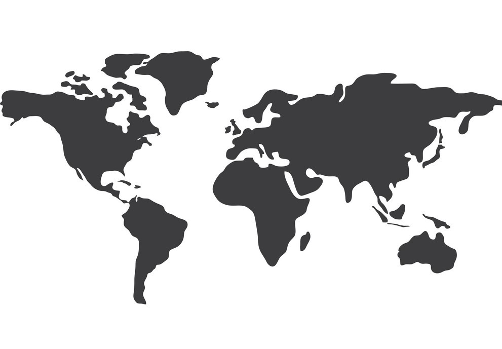

# Proyecto3_GeoQ

OBJETIVO:
Tenemos como objetivo para este proyecto, encontrar la ubicación perfecta para la sede de una nueva empresa, siguiendo una serie de requisitos esenciales teniendo en cuenta el tipo de empleados de dicha empresa.

EJECUCIÓN:
Para conseguir dicho objetivo, los requisitos que he tenido en cuenta como detonante para la decisión final de ubicación son los siguientes:
- La mayoría de los empleados tienen al menos un hijo, por lo que necesitarán una guardería cercana.
- Uno de los jefes necesita viajar frecuentemente por lo que necesitará un aeropuerto cerca.
- La mayoría de los trabajadores tienen edades comprendidas entre 25 y 40 años por lo que es preferible que estén ubicados cerca de zonas de ocio, tipo pub.
-- El CEO de la empresa es vegano, por lo que necesitará restaurantes con este tipo de comida cerca.

Para aplicar estos requisitos y poder hacer una comparativa de estos criterios de elección, he escogido 3 ciudades, que considero que tienen muchas diferencias en cuanto a demografía, situación, climatología, industria, turismo, etc **Madrid, Mallorca y Salamanca**.

He utilizado las coordenadas de puntos céntricos de estas ciudades para realizar las llamadas a la API de Foursquare utilizando aeropuerto, guarderías, restaurantes veganos y zonas de ocio tipo pub.

Una vez descargada toda la información en formato json, hice un cálculo de las distancias entre las coordenadas de origen y la información obtenida de Foursquare.

ESTRUCTURA DEL PROYECTO: 
    - Una carpeta data que contiene:
        - el csv final con el dataframe de los valores ponderados
        - el csv de los datos obtenidos para Madrid
        - el csv de los datos obtenidos para Mallorca
        - el csv de los datos obtenidos para Salamanca
    - Una carpeta notebook que contiene:
        - documento jupyter de trabajo --> ubicación_geo
        - docuemntos json importados diréctamente a MongoDB (MADRID, MALLORCA, SALAMANCA)
    - Una carpeta gitignore
    - Una carpeta src con un archivo de funciones de código --> cleaning_functions_GEOQ
    - Un archivo Readme
    
CONCLUSIÓN FINAL:
Una vez normalizados y ponderados los valores obtenidos de las distancias entre cada establecimiento de nuestros requerimientos, y las coordenadas iniciales del punto concreto de cada una de las 3 ciudades, obtengo un valor final para cada ciudad, concluyendo según este valor, y teniendo en cuenta un valor de 1 sobre 10 a los restaurantes veganos, de 2 sobre 10 a los pubs, de 3 sobre 10 a guardaerías cercanas, y de 4 sobre 10 a aeropuerto cercano, que la ciudad más idónea para ubicar la sede de la empresa es SALAMANCA.

Para conseguir los objetivos del proyecto he usado los siguientes recursos:
--[Foursquare API](https://foursquare.com/)
--[MongoDB](https://www.mongodb.com/)

- sys(https://docs.python.org/3/library/sys.html)
- requests(https://pypi.org/project/requests/2.7.0/)
- pandas(https://pandas.pydata.org/)
- dotenv(https://pypi.org/project/python-dotenv/)
- json(https://docs.python.org/3/library/json.html)
- os(https://docs.python.org/3/library/os.html)
- reduce(https://docs.python.org/3/library/functools.html)
- operator(https://docs.python.org/3/library/operator.html)
- dumps(https://pymongo.readthedocs.io/en/stable/api/bson/json_util.html)
- folium(https://pypi.org/project/folium)
- Marker, Icon, Map(https://matplotlib.org/stable/api/_as_gen/matplotlib.pyplot.plot.html)
